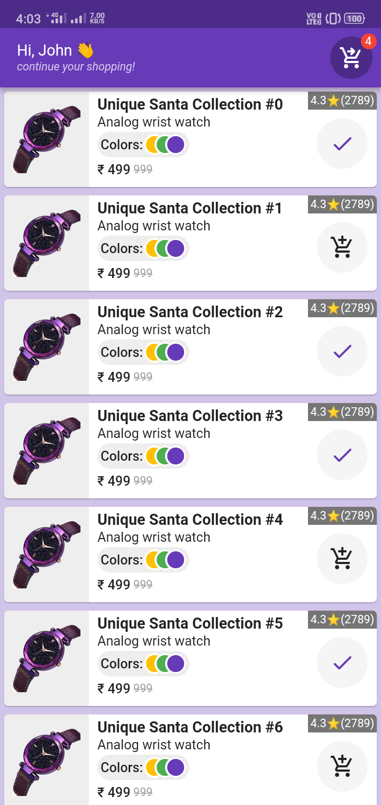
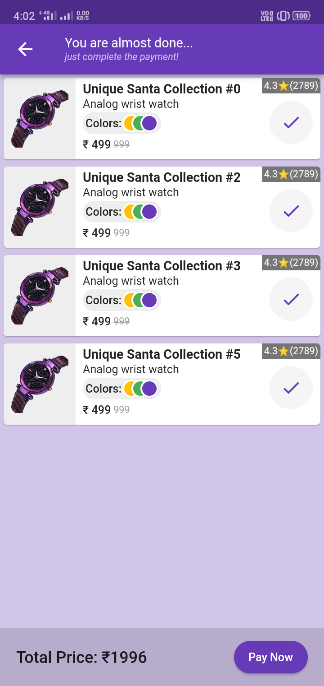

# simple_app

A sample that demostrates [`ValueNotifier`](https://api.flutter.dev/flutter/foundation/ValueNotifier-class.html) in [flutter](https://flutter.dev).

This is a basic example of one of the state management techniques that come inbuilt with flutter. [`ValueListenableBuilder`](https://api.flutter.dev/flutter/widgets/ValueListenableBuilder-class.html) can be used to build app throughout different states of app.

---
## Architecture 📏🛠
[Model-View-Controller (MVC)](https://g.co/kgs/6YDU8y) architecture is followed.

---
## Project Board 🎯

[Basic Kanban](https://github.com/srikanth7785/simple_stateManagement_app/projects/2) board is used through out the development of this project, the same can be found [here.](https://github.com/srikanth7785/simple_stateManagement_app/projects/2)

---
## Quick Peek 👀

| Home | Checkout |
|:---:|:---:|
|||

---

Feel free to check out my other [repositories](https://github.com/srikanth7785?tab=repositories) as well.